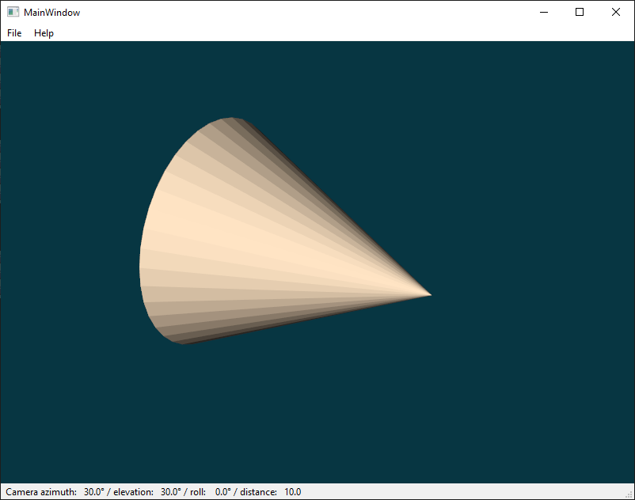
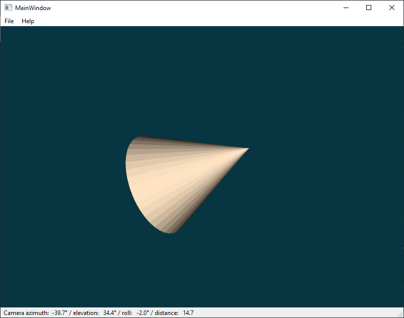
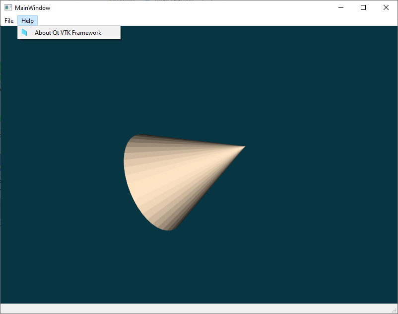
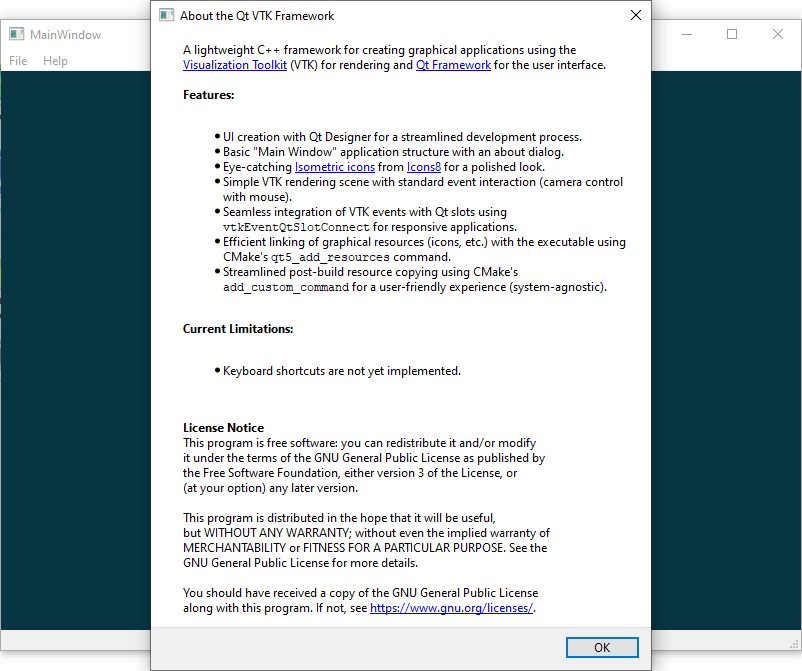

# VTK Playground

This repository chronicles my self-paced exploration of the VTK (Visualization
Toolkit) library and the GoogleTest unit testing framework.

## Project Goals

* Gain experience with VTK for creating scientific visualizations.
* Learn how to write unit tests using GoogleTest for VTK code.
* Document and share the learning process.

## Project Structure

* **CMake:** Contains custom CMake scripts, mainly for `find_package` support.
* **src:** Contains the source code for the VTK examples and unit tests.
* **include:** (Optional) For any custom header files.
* **tests:** (Optional) Dedicated directory for GoogleTest unit tests (if not
placed in `./src`).
* **doc:** (Optional) For any documentation or tutorials you create.
* **extern:** Contains external libraries used in the project.

## Prerequisites

* **C++ compiler:**  A C++11-compliant compiler (e.g., GCC, Clang).
* **VTK:** Download and install [VTK](https://vtk.org/download/). Follow the
installation instructions for your operating system.
* **GoogleTest:** Download and install
[GoogleTest](https://github.com/google/googletest). Follow the compilation
instructions.

## Building and Running

1. **Clone this repository:** `git clone https://your_repository_url.git`
2. **Build:**
    1. Create a build directory and `cd` into it.
    2. Configure the build using:

        ```shell
        cmake -B . -S <path_to_vtk_playground_source>
        ```

        on win32 use:

        ```shell
        cmake -B . -S <path_to_vtk_playground_source> -DCMAKE_PREFIX_PATH=C:\Qt\<version>\<compiler>;<path_to_vtk_installation>
        ```

        Optionally you can use `-G` switch to specify generator, like Ninja.
    3. Build using:

       ```shell
       cmake --build . --config <Debug/RelWithDebInfo/Release/MinSizeRel>
       ```

       to build everything. Or using a `--target` switch to specify a target.
    4. Deploy (for win32 only) executing `windeployqt.exe` on each of the
    generated executables. `windeployqt.exe` can be found in
    `C:\Qt\<version>\<compiler>\bin`.

       Also use `windeployqt.exe` to copy `Qt5Core.dll`. This is for reason that
       `windeployqt.exe` patches `Qt5Core.dll` when copying so it looks for
       plugins relative to generated executables.
3. **Run:** Execute the compiled VTK examples and unit tests. Examples are
installed in the `./bin` of build directory.

## Available Build Targets

1. **QtVTKFramework**: A lightweight C++ framework for creating graphical
   applications using the Visualization Toolkit (VTK) for rendering and Qt for
   the user interface.

   **Features:**
   * UI creation with Qt Designer for a streamlined development process.
   * Basic "Main Window" application structure with an about dialog.
   * Eye-catching [Isometric icons](https://icons8.com/icons/isometric)
     from [Icons8](https://icons8.com) for a polished look.
   * Simple VTK rendering scene with standard event interaction (camera control
     with mouse).
   * Seamless integration of VTK events with Qt slots using
     `vtkEventQtSlotConnect` for responsive applications.
   * Efficient linking of graphical resources (icons, etc.) with the executable
     using CMake's `qt5_add_resources` command.
   * Streamlined post-build resource copying using CMake's `add_custom_command`
     for a user-friendly experience (system-agnostic).

   **Current Limitations:**
   * Keyboard shortcuts are not yet implemented.

   **Screenshots:**
   
   
   
   

2. **all**: Build all abovementioned targets.

## Additional Notes

1. To compile and install the VTK from source code (win32 only) use following:

   ```shell
   cmake -B . -S ..\..\references\cpp\vtk -GNinja -DVTK_ENABLE_KITS:BOOL=ON -DVTK_BUILD_EXAMPLES:BOOL=ON -DVTK_GROUP_ENABLE_Qt:STRING=YES -DQt5_DIR:PATH=C:\Qt\<5.x.x>\<compiler>\lib\cmake\Qt5 -DVTK_MODULE_ENABLE_VTK_GUISupportQt:STRING=YES -DCMAKE_CONFIGURATION_TYPES:STRING=Release
   cmake --build . --config Release
   cmake --install . --install-prefix <path_to_installation_dir>
   ```

   It seems that Ninja generator provides much faster building and compiling
   than the default one (Visual Studio 17 2022).

2. All targets in this project use the [clipp](https://github.com/muellan/clipp)
   library for parsing command-line options.

## Contributing

This project is primarily for personal learning, but feel free to fork the
repository and submit pull requests for any improvements or additional examples.

## License

This project is licensed under the GNU General Public License v3.0 (GPLv3). You
can find the full license text
[here](https://www.gnu.org/licenses/gpl-3.0.en.html).

## Contact

Feel free to reach out with any questions or suggestions.
